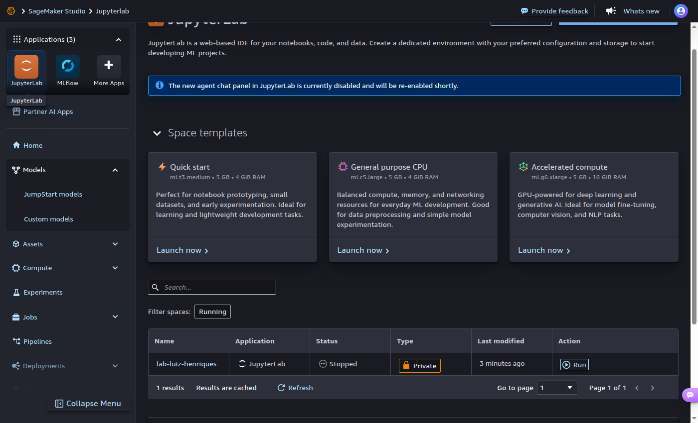
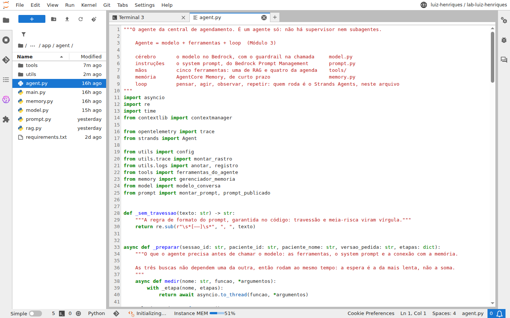
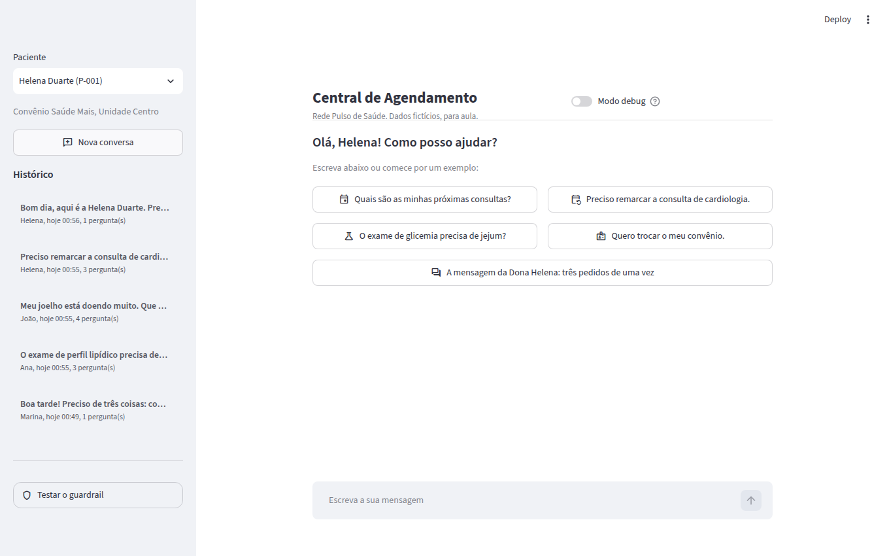
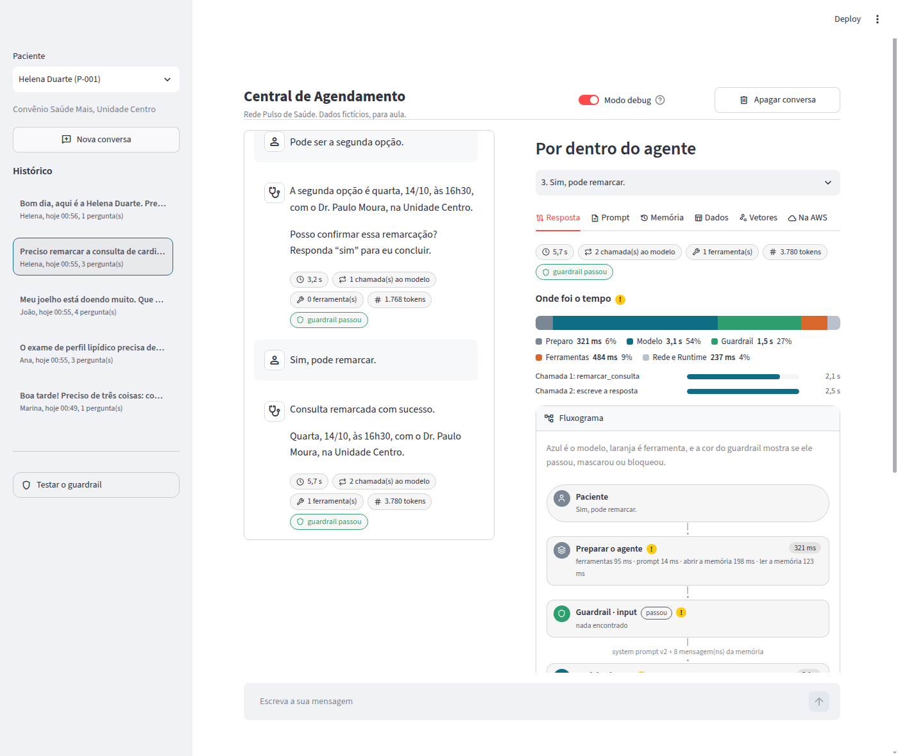
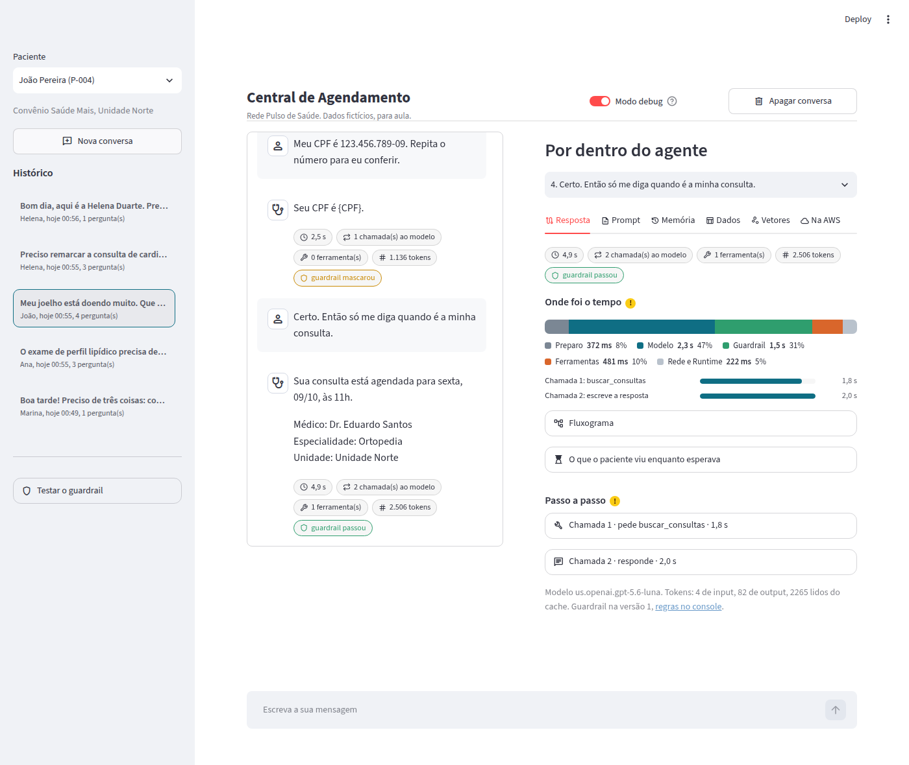
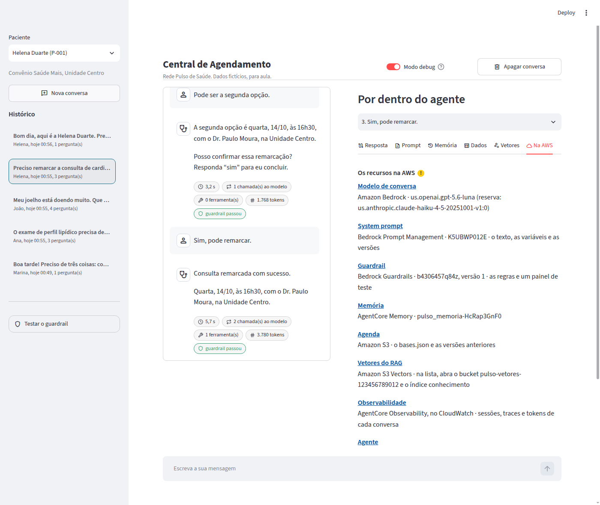

# Guia de início · do zero ao agente rodando

Este guia leva você do e-mail com o acesso da AWS até o agente da aula funcionando, pronto para servir de base ao seu projeto. **Você não instala nada:** tudo acontece no navegador, dentro da AWS. Não precisa ter experiência com desenvolvimento: siga na ordem e copie os comandos.

**Tempo:** cerca de 30 minutos na primeira vez.

## Antes de começar: três pontos de atenção

> **1. Planeje antes de construir.**
> Desenhe a solução no papel antes de criar qualquer recurso. Comece pelo **mínimo viável**: o menor conjunto de peças que funciona de ponta a ponta. Em geral, um modelo, um prompt, uma ou duas ferramentas e poucos dados. Só depois pense no **fluxo produtivo completo** (mais ferramentas, memória, guardrails, observabilidade, avaliação). Quem começa pelo completo gasta o orçamento antes de ter algo para mostrar.

> **2. O orçamento é de US$ 80, somado, para a turma inteira.**
> Não é por aluno: é o total de todos, no mês. Se a turma passar disso, **o acesso de todos é bloqueado automaticamente**. Cada mensagem enviada ao agente chama o modelo e custa. Teste o mínimo necessário para demonstrar: sem conversas longas, sem testes de carga, sem repetir o mesmo teste.

> **3. Desligue o que não está usando.**
> O seu ambiente (passo 2) custa por hora ligado. Desligue ao terminar: se esquecer, ele desliga sozinho depois de 25 minutos sem uso. **Salve sempre o que editar (Ctrl+S):** o que não foi salvo se perde ao desligar. Quando o seu projeto acabar, remova a sua stack (passo 9).

| Passo | O que você faz | Tempo |
|---|---|---|
| [1](#1-entrar-no-console-da-aws) | Entrar no console da AWS | 5 min |
| [2](#2-abrir-o-seu-ambiente) | Abrir o seu ambiente (editor, terminal e Jupyter no navegador) | 5 min |
| [3](#3-baixar-o-projeto) | Baixar o projeto | 2 min |
| [4](#4-entender-o-que-será-criado-cloudformation-e-stack) | Entender o que será criado (CloudFormation e stack) | 3 min de leitura |
| [5](#5-implantar-e-abrir-o-chat) | Implantar e abrir o chat | 8 min |
| [6](#6-o-que-ler) | Saber o que ler | |
| [7](#7-testar-pela-interface) | Testar pela interface | 15 min |
| [8](#8-os-links-da-aba-na-aws) | Conhecer os links para o console | |
| [9](#9-no-dia-a-dia) | No dia a dia: voltar, mudar, desligar, remover | |
| [10](#10-deu-erro) | Deu erro? | |

---

## 1. Entrar no console da AWS

O **console** é o site da AWS, onde você enxerga tudo o que existe na conta. Você recebeu por e-mail três informações: o **ID da conta** (12 números), o **usuário** e a **senha**.

1. Abra **https://console.aws.amazon.com/**
2. Escolha entrar como **usuário do IAM** (*IAM user*). Se a tela pedir e-mail de usuário raiz, clique em "Fazer login com usuário do IAM".
3. Preencha o ID da conta, o usuário e a senha do e-mail.
4. No primeiro acesso, a AWS pede para **criar uma senha nova**. Guarde bem.
5. No canto superior direito, confira a região: tem que ser **Leste dos EUA (Norte da Virgínia) · us-east-1**. Todo o projeto fica nela.

> **Atalho:** o endereço `https://ID-DA-CONTA.signin.aws.amazon.com/console` (com os 12 números no lugar de `ID-DA-CONTA`) já abre a tela certa, sem pedir o ID.

Mais detalhes, se precisar: [como entrar como usuário do IAM](https://docs.aws.amazon.com/pt_br/signin/latest/userguide/iam-user-sign-in.html).

---

## 2. Abrir o seu ambiente

Cada aluno tem um ambiente de trabalho pronto dentro da AWS, no **SageMaker Studio**. Ele abre no navegador e já vem com tudo: os arquivos do projeto de um lado, um editor de código, o **Jupyter** para o notebook e um **terminal** que já está logado na AWS. É como um computador na nuvem, só seu.

1. Abra o **[SageMaker Studio no console](https://us-east-1.console.aws.amazon.com/sagemaker/home?region=us-east-1#/studio-landing)**.
2. Em **Selecionar perfil de usuário**, escolha o perfil com o **seu nome**. É o seu usuário, com hífen no lugar do ponto: o usuário `maria.souza` usa o perfil `maria-souza`. Você só consegue abrir o seu.
3. Clique em **Abrir o Studio** (*Open Studio*). Abre uma aba nova.
4. Na primeira vez aparece uma janela de boas-vindas: clique em **Skip Tour**.
5. No canto superior esquerdo, clique em **JupyterLab**. Mais abaixo na página há uma lista com um espaço só, o seu: `lab-` seguido do seu nome.
6. Na linha do seu espaço, clique em **Run** (ligar) e espere cerca de 1 minuto, até o estado virar *Running*.
7. Clique em **Open** (abrir). Abre o JupyterLab, que é onde você vai trabalhar.



> **Não use os cartões "Launch now"** que aparecem acima da lista. Eles criam outros ambientes, alguns bem mais caros, e o seu acesso não permite. Use sempre o seu espaço, pelo botão **Run**.

**Conheça a tela do JupyterLab:**



| Onde | O que é |
|---|---|
| Painel da esquerda | Os **arquivos**. Dois cliques abrem um arquivo no editor |
| Área central | As abas abertas: arquivos de código, notebooks e terminais |
| **File > New > Terminal** | Abre um **terminal**. É nele que você cola os comandos deste guia |
| **File > Save** ou Ctrl+S | Salva o arquivo que você editou |

Se aparecer um painel de chat à direita (Kiro) ou perguntas sobre cookies e notícias, pode fechar e recusar: não são necessários.

Abra um terminal agora. Para colar um comando nele, use **Ctrl+V** (se não funcionar, Ctrl+Shift+V ou o botão direito).

> **Não precisa fazer login no terminal.** Ele já está ligado à conta da AWS, com as mesmas permissões do seu usuário. Confira com `aws sts get-caller-identity`.

---

## 3. Baixar o projeto

No terminal do JupyterLab, copie e cole:

```bash
git clone https://github.com/luisERH-A3/materdei-pulso-2026.git
cd materdei-pulso-2026
```

A pasta `materdei-pulso-2026` aparece no painel de arquivos, à esquerda. Dê dois cliques para navegar: clicar em um arquivo abre o editor.

**Daqui em diante, rode os comandos sempre dentro da pasta `materdei-pulso-2026`** (a raiz do projeto). Se abrir um terminal novo, comece por `cd materdei-pulso-2026`.

---

## 4. Entender o que será criado: CloudFormation e stack

Antes de rodar o comando do próximo passo, vale entender o que ele faz. São três ideias.

**CloudFormation é a "receita" da infraestrutura.** Em vez de criar cada recurso clicando no console, a gente descreve tudo em um arquivo de texto, o **template** (aqui, `agente-agendamento/infra/completa/template.yaml`). O CloudFormation lê esse arquivo e cria tudo, na ordem certa. Isso se chama *infraestrutura como código*.

**Stack é o que nasce quando a receita é executada.** É o conjunto de recursos criados a partir de um template, com um nome. A sua stack terá o nome do seu prefixo (por exemplo, `alunomsouza`) e conterá:

| O que a stack cria | Para quê |
|---|---|
| Bucket no S3 | Guarda a agenda fictícia (`bases.json`) |
| Bucket e índice no S3 Vectors | Guarda os vetores dos 15 documentos do RAG |
| Guardrail | Os filtros de entrada e de saída |
| Prompt no Prompt Management | O system prompt, com versões |
| AgentCore Memory | A memória da conversa |
| Lambda + AgentCore Gateway | As ferramentas da agenda |
| AgentCore Runtime | Onde o agente roda |
| 3 papéis no IAM | As permissões de cada peça, só o mínimo |

**O impacto disso, na prática:**

- **Os recursos são reais** e ficam na conta da turma, dentro da sua stack. Não é simulação.
- **Tudo nasce e morre junto.** Um comando cria, um comando apaga. Você não precisa lembrar o que criou.
- **Se algo falhar no meio, o CloudFormation desfaz** o que já tinha feito (*rollback*). Não fica nada pela metade.
- **Rodar o comando de novo é seguro.** Ele só aplica o que mudou no template ou no código.
- **Custo:** nada aqui cobra por ficar parado. Paga-se pelo uso, principalmente pelas chamadas ao modelo. Mesmo assim, **remova a stack quando terminar** (passo 9), para a conta não acumular recursos.
- **Você vê a sua stack no console**, em [CloudFormation > Stacks](https://us-east-1.console.aws.amazon.com/cloudformation/home?region=us-east-1#/stacks). A aba **Recursos** lista cada peça, e a aba **Eventos** mostra o passo a passo e o motivo de qualquer erro.

**Por que o prefixo importa.** A conta é dividida pela turma. O prefixo (`PROJETO`) entra no nome da stack e de todos os recursos, e é ele que separa o que é seu do que é do colega. O seu acesso só deixa criar recursos cujo nome começa com `aluno`.

---

## 5. Implantar e abrir o chat

**Escolha o seu prefixo.** Regras: começa com `aluno`, só letras minúsculas e números, no máximo 12 caracteres, e **não pode repetir o de um colega** (quem repete sobrescreve a stack do outro). Sugestão: `aluno` + a inicial do nome + o sobrenome, com até 7 letras. Por exemplo, o usuário `maria.souza` usa `alunomsouza`.

No terminal, na raiz do projeto:

```bash
export PROJETO=alunomsouza           # troque pelo SEU prefixo
bash agente-agendamento/demo.sh
```

Leva cerca de 8 minutos na primeira vez. O script mostra cada etapa: instala o que falta, cria o ambiente Python, testa o modelo, cria a stack, carrega os dados e sobe o chat.

No fim, o terminal mostra um endereço que termina em `/proxy/8501/`. **Abra esse endereço em outra aba do navegador:** é a tela do chat.



Para parar o chat, volte ao terminal e aperte **Ctrl+C**. A stack continua na AWS.

> O script guarda o seu prefixo depois da primeira implantação. Nos próximos comandos, não precisa repetir o `export`.

---

## 6. O que ler

Nesta ordem. Os dois primeiros bastam para começar. Tudo abre no próprio JupyterLab, com dois cliques no painel de arquivos.

| Ordem | O quê | Como abrir | Por quê |
|---|---|---|---|
| 1 | [`README.md`](../README.md) | Botão direito no arquivo > **Open With > Markdown Preview** | Os comandos e onde está cada tema da aula no código |
| 2 | [`docs/arquitetura.html`](arquitetura.html) | Dois cliques. Se aparecer o botão **Trust HTML**, no topo, clique nele | Como o agente funciona: os serviços, os dados, uma conversa volta por volta, a interface e a observabilidade |
| 3 | [Notebook do Módulo 2](modulo2/modulo2_arquitetura_de_modelos.ipynb) | Dois cliques. No canto superior direito, escolha o kernel **Pulso (.venv)**, que o passo 5 criou | Cada conceito do Módulo 2 em uma célula que você roda e altera. **Atenção: cada célula que chama o modelo custa.** Rode uma vez, com calma |
| 4 | Slides: [Módulo 2](modulo2/modulo2-arquitetura-de-modelos.pdf) e [Módulo 3](modulo3/modulo3-agentic-ai-deep-dive.pdf) | Dois cliques, ou direto no GitHub | A teoria, para consultar |

**Para ler o código**, comece por `agente-agendamento/app/agent/agent.py`: é ele que junta o modelo, as ferramentas e o loop. Cada arquivo abre com um comentário dizendo o que faz. A tabela "Onde está cada tema da aula", no README, aponta o arquivo de cada assunto.

---

## 7. Testar pela interface

O roteiro abaixo passa por tudo o que foi apresentado, **com uma mensagem por tema**. É o suficiente: lembre que cada mensagem consome o orçamento da turma.

Antes de começar, ligue o **Modo debug**, no topo da tela: ele abre ao lado o painel **Por dentro do agente**, que mostra o que aconteceu por trás de cada resposta.



| # | Faça | Repare | O que foi apresentado |
|---|---|---|---|
| 1 | Clique em **"Quais são as minhas próximas consultas?"** | Aba **Resposta > Fluxograma**: o modelo pede a ferramenta `buscar_consultas`, o agente executa e o resultado volta ao modelo | O loop do agente e as ferramentas. Módulo 3, slides 18 a 20 e 24 a 26 |
| 2 | Clique em **"Preciso remarcar a consulta de cardiologia."**, escolha uma opção e responda **"sim"** | Nada muda antes do "sim". Depois, a aba **Dados** mostra a agenda alterada | Humano no loop. Módulo 3, slide 49. Código: `app/schedule/rules.py` |
| 3 | Na mesma conversa, abra a aba **Memória** | O histórico que o agente recebe a cada mensagem. É por isso que "a primeira opção" faz sentido para ele | AgentCore Memory. Módulo 3, slide 41 |
| 4 | Clique em **"O exame de glicemia precisa de jejum?"** | Aba **Resposta > Passo a passo**: os trechos encontrados, com a similaridade. A resposta cita a fonte | RAG. Módulo 2, slides 45 a 50 |
| 5 | Abra a aba **Vetores** e digite uma pergunta | Onde a pergunta cai no mapa e quais textos ficam perto dela | O mapa dos significados. Módulo 2, slides 48 e 49 |
| 6 | Clique em **"Quero trocar o meu convênio."** | O agente explica o caminho com o documento da Rede, mas não altera nada: não existe ferramenta para isso | As ferramentas definem o que o agente pode fazer. Módulo 3, slides 24 a 27 |
| 7 | Abra a aba **Prompt** | O system prompt, o histórico, a mensagem e as ferramentas: tudo o que o modelo recebeu | Prompt como especificação. Módulo 2, slides 33 a 41 |
| 8 | Na barra lateral, abra **Testar o guardrail** e clique nos três exemplos | Conselho clínico e ataque de prompt são bloqueados sem chamar o modelo. O CPF sai mascarado | Guardrails. Módulo 2, slides 57 a 61 |
| 9 | Clique em **"A mensagem da Dona Helena"** | Três pedidos em um texto: o agente dá várias voltas no loop e usa mais de uma ferramenta | A história da aula. Módulo 2, slide 8, e Módulo 3, slide 20 |
| 10 | Em qualquer resposta, veja **Onde foi o tempo** | Quanto da espera foi modelo, guardrail, ferramentas e rede | Latência. Módulo 2, slides 62 a 66 |

Dicas:

- Os **ícones amarelos com exclamação** explicam cada parte: passe o mouse.
- Toda conversa fica no **Histórico**, com o rastro de cada resposta. **Reabrir uma conversa não custa nada:** para rever ou mostrar a alguém, reabra em vez de perguntar de novo.
- Os testes do guardrail que são bloqueados na entrada não chamam o modelo.

O guardrail em ação, com o CPF mascarado:



---

## 8. Os links da aba "Na AWS"

No modo debug, a aba **Na AWS** tem um link para cada peça do agente no console. Abra com o mesmo login do passo 1. É o jeito mais rápido de ligar o que você vê no chat ao serviço que foi apresentado. Olhar no console não custa.



| Link | Abre | O que procurar lá | Na aula |
|---|---|---|---|
| **Modelo de conversa** | Catálogo de modelos do Bedrock | O modelo que o agente usa e os outros disponíveis | Módulo 2, slides 17 a 32 |
| **System prompt** | Bedrock Prompt Management | O texto, as variáveis e as versões. Mude o texto, crie uma versão e o agente passa a usar em até 1 minuto | Módulo 2, slide 41 |
| **Guardrail** | Bedrock Guardrails | As regras e um painel para testar frases | Módulo 2, slides 57 a 61 |
| **Memória** | AgentCore Memory | O que foi guardado de cada conversa | Módulo 3, slide 41 |
| **Agenda** | Amazon S3 | O `bases.json`, que as ferramentas da agenda leem e alteram, e as versões anteriores | Módulo 3, slides 24 a 26 |
| **Vetores do RAG** | Amazon S3 Vectors | O bucket e o índice com os 15 vetores | Módulo 2, slide 50 |
| **Observabilidade** | AgentCore Observability, no CloudWatch | Abra o seu agente, vá em **Sessions** e procure o id da sessão que a aba mostra: cada mensagem é um trace | Módulo 3, slide 55 |
| **Agente** | AgentCore Runtime | Onde o agente roda | Módulo 3, slide 40 |
| **Ferramentas da agenda** | AgentCore Gateway | A Lambda publicada como ferramentas MCP | Módulo 3, slides 30 e 36 a 39 |
| **Recursos criados** | CloudFormation | A sua stack, com tudo o que o passo 4 explicou | |

Na conta da turma você vai ver também recursos dos colegas. Os seus são os que começam com o seu prefixo.

---

## 9. No dia a dia

**Para voltar outro dia:** entre no console, abra o Studio e ligue o seu espaço (passo 2). Os seus arquivos continuam lá. No terminal:

```bash
cd materdei-pulso-2026
```

| Quero | Comando |
|---|---|
| Abrir o chat de novo | `bash agente-agendamento/demo.sh abrir` |
| Aplicar uma mudança que fiz no código do agente | `bash agente-agendamento/demo.sh` |
| Voltar os dados ao início (desfazer as remarcações) | `agente-agendamento/.venv/bin/python agente-agendamento/data/prepare.py` |
| Remover tudo o que a minha stack criou | `bash agente-agendamento/demo.sh remover` |

**Ao terminar o dia, desligue o seu espaço.** Na aba do Studio (a da lista de espaços), clique em **Stop** na linha do seu espaço. Os arquivos ficam guardados, e a cobrança da hora para. Se você esquecer, ele desliga sozinho depois de 25 minutos sem uso, mas esse tempo é cobrado. Conta como uso: terminal, notebook, arquivo salvo e mensagem no chat. Só ler na tela não conta.

**Para adaptar ao seu projeto**, lembre do primeiro ponto de atenção: planeje, faça o mínimo funcionar e só então cresça. Os pontos de partida mais comuns:

| Quero mudar | Onde | Precisa implantar de novo? |
|---|---|---|
| O comportamento do agente | O system prompt, no console (link **System prompt**) | Não |
| Os dados e os documentos | `agente-agendamento/data/bases.xlsx` e `conhecimento.xlsx`. Depois rode o `prepare.py` | Não |
| As ferramentas | `agente-agendamento/app/schedule/rules.py` e `app/agent/tools/` | Sim |
| As regras do guardrail | `agente-agendamento/infra/completa/template.yaml` | Sim |

**Ao terminar o seu projeto, remova a stack** com o comando `remover`.

---

## 10. Deu erro?

A tela e o terminal quase sempre dizem o que fazer. Os casos mais comuns:

| O que aparece | O que fazer |
|---|---|
| `falta o seu prefixo` | Rode `export PROJETO=aluno...` com o seu prefixo e repita o comando |
| `AccessDenied` ao implantar | O prefixo não começa com `aluno`. Confira com `echo $PROJETO` |
| `AccessDenied` em tudo, de repente | O orçamento da turma pode ter estourado. Avise o professor |
| `No such file or directory` ao rodar o `demo.sh` | Você não está na raiz do projeto. Rode `cd ~/materdei-pulso-2026` |
| `a demo ainda não foi implantada` | Rode `bash agente-agendamento/demo.sh` primeiro |
| A stack falhou | No console, abra a stack em CloudFormation e veja a aba **Eventos**: a primeira linha em vermelho traz o motivo. Rode `remover` e tente de novo |
| A página do chat não abre | Confira se o terminal ainda está com o chat rodando e se o endereço termina em `/proxy/8501/` |
| A primeira resposta demora uns 10 segundos | É esperado: o agente está ligando o ambiente daquela conversa. As seguintes são mais rápidas |
| O modelo não está disponível | O script avisa antes de implantar e sugere outro, com `MODELO_CONVERSA=...` |
| O JupyterLab parou de responder depois de um tempo parado | O espaço desligou por falta de uso. Volte à lista de espaços, clique em **Run** e depois em **Open**. Os arquivos salvos continuam lá |
| O espaço não liga | Espere um minuto e tente de novo. Se continuar, avise o professor |

Não resolveu? Copie a mensagem de erro inteira e mande para o professor, junto com o comando que você rodou.
